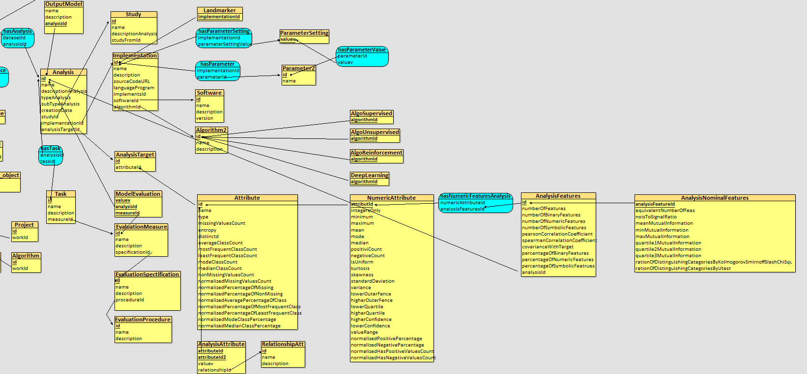

# Modelisation-Metadonnees
This project is the part PostgreSql of datastore benchmark development

## Tools
- Docker
- Jupyter Notebook
- Looping

## The metamodel
https://app.diagrams.net/#G1ENbUi_XvuOzLl-WEcMZsnfzN-0eZqa8L

## The modeling to be implemented
The modeling is divided into 4 parts: Data Zone, Process Zone，Security, authentication & monitoring Zone, and Processed Data Zone.

Data Zone

In this part, there is a constraint on the entity class of User_metadata, in which we can only put string type or integer type data into the database.

For each ingest, source, sample and dataset, there is an attribute "userid" which indicates the user and for the sample and the dataset, there is an association class "has License" added to the correspond license (connection to the part authentication & monitoring Zone).

And for each source, I added an entity class to say that it may follow another or several sources and it may also be followed by another or several sources.

Process Zone

Every dataset may have one or several workflows and it may have the same workflow several times. To solve the problem of repeated workflows in one dataset, I added an attribute "existingTimes" to distinct the existing of the same workflow in one dataset (connection to the Processed Data Zone).
And the same solution for the repeating operation in one workflos.

For each operation, it may follow another or several operations and it may also be followed by another or several operation, in addition, one operation's output's assertion have to be the same as the follwing operation's input's assertion. To solve this problem, I added an entity class "follows" to show the relationship of one operation follows another and an attribute indicates the output of the operation before as the input of the following operation. We can also reuse the operation by tracing the output of the operation before.

Security, authentication & monitoring Zone

In the entity class "Userr", I deleted the attribute privilege and replaced it by an association class "hasPrivilege" to show user's privilege level.

And there are 3 different zones in the 4th part: Consumption Tools, Analysis and Related Work.

Consumption Tools

Analysis

For each study, it can study from at most one another study so I added an attribute "studyFromId" which can be null to indicate the study before.

For every 2 attributes, we need to analyse the relationship between them so in the entity class "AnalysisAttribute", I put "attributeId" and "attributeId2" to show that the analysis is between these two attributes, then "relationshipId" indicates the relationship.

And to analyse a numeric attribute, I deleted the "AnalysisNumericFeatures" because we already have all the metrics we want in the entity class "NumericAttribute" and I added an association class to connect it with "AnalysisFeatures" where records all the features we are interested in.

Related Work

## Files in the folder
